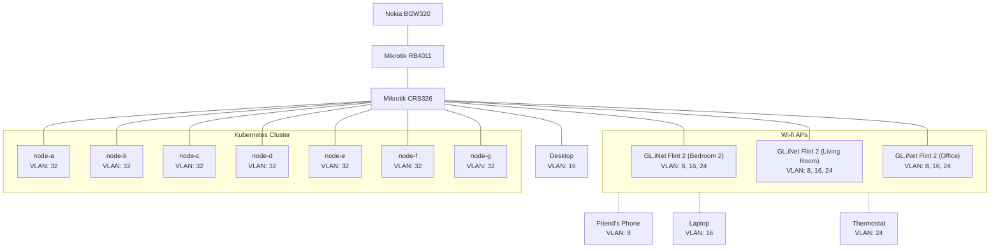

This document outlines how traffic is routed and segmented across the homelab network.

## Overview

The network uses VLANs to segregate traffic by device type and trust level. All traffic flows through a central switch connected to a router, which enforces inter-VLAN routing and firewall rules.

## VLANs

Four VLANs segregate network traffic:

| VLAN ID | Name           | Purpose                           |
| ------- | -------------- | --------------------------------- |
| 8       | General        | Guest and untrusted devices       |
| 16      | Trusted        | Personal devices                  |
| 24      | IoT            | Smart home devices                |
| 32      | Infrastructure | Kubernetes cluster and management |

Each VLAN ID corresponds to a `/24` CIDR range.

:::info Infrastructure
The _Infrastructure_ VLAN is an exception—it uses a `/23` CIDR range, with one `/24` slice reserved for the router and the other for in-cluster IPAM.

This separation prevents IPAM from colliding with upstream DHCP allocations.
:::

## Architecture

### Access Ports

Devices connected directly to the switch (like cluster nodes and the desktop) are configured on static access ports. Each access port is tagged to a single VLAN.

### Trunk Ports

Wi-Fi access points are connected to the switch via trunk ports. Each physical Wi-Fi network broadcasts a specific VLAN, allowing the same access point to serve multiple networks (e.g., a guest network and a trusted network simultaneously).

### Router

The switch connects to the router via a trunk port carrying all VLANs. The router's firewall enforces inter-VLAN routing rules, controlling which VLANs can communicate with each other.

## In-Cluster Networking

In-cluster, there are several `Gateway` resources—each receiving a distinct `LoadBalancer`-type service. These receive IP addresses from the in-cluster IPAM pool within the _Infrastructure_ VLAN. The cluster CNI is configured to peer these IP addresses with the upstream router, making them discoverable on the broader network.

## Further Reading

Refer to [Security](./security.md) for more info about firewall rules and in-cluster networking policies.
